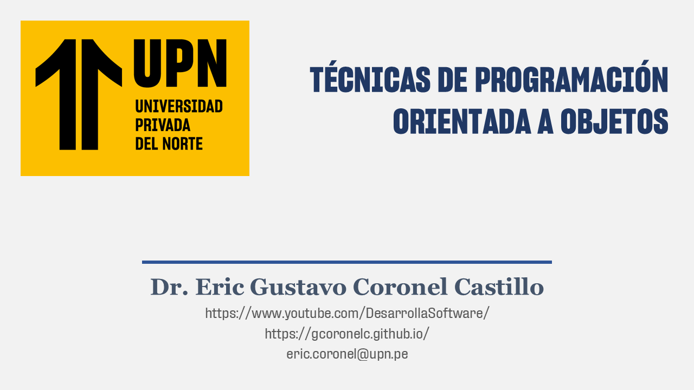

# DATOS GENERALES DEL CURSO

## DATOS DEL CURSO

- Nombre: ESTRUCTURA DE DATOS
- Lugar: Universidad Pricada del Norte
- Horario: 
  * Lunes de 07:30 a 09:00 Horas
  * Martes de 07:30 a 10:40 Horas
- Inicio: 25.MAR.2026
- Duración: 16 Semanas

## DATOS DEL DOCENTE

- Docente: Dr. Eric Gustavo Coronel Castillo
- Blog: https://gcoronelc.blogspot.com/
- Canal Youtube: https://www.youtube.com/channel/UC7c3C0Dtr6HnSpxAAWN643A?sub_confirmation=1
- Grupo FaceBook: https://www.facebook.com/groups/desarrollasoftware/
- Recursos: http://gcoronelc.github.io/

# RECURSOS EN YUTUBE

- JAVA OO: https://bit.ly/2FCowSU
- JDBC: https://bit.ly/2TaHisH
- PL/SQL: https://bit.ly/2uvE9cF
- C++: https://bit.ly/2R4nZP2
- ORCLE: https://bit.ly/2QZIBbf
- JAVA WEB CON ORACLE: https://bit.ly/36D6njZ
- WS SOAP EJEMPLO 1: https://bit.ly/2Rd7osH
- WS SOAP EJEMPLO 2: https://bit.ly/39PalrT

